# Procesverslag

Markdown is een simpele manier om HTML te schrijven.  
Markdown cheat cheet: [Hulp bij het schrijven van Markdown](https://github.com/adam-p/markdown-here/wiki/Markdown-Cheatsheet).

Nb. De standaardstructuur en de spartaanse opmaak van de README.md zijn helemaal prima. Het gaat om de inhoud van je procesverslag. Besteedt de tijd voor pracht en praal aan je website.

Nb. Door _open_ toe te voegen aan een _details_ element kun je deze standaard open zetten. Fijn om dat steeds voor de relevante stuk(ken) te doen.

## Jij

  
uitwerken voor kick-off werkgroep

### Auteur:

Victoria Hubenova

#### Je startniveau:

Blauw

#### Je focus:

Surface plane

## Je website

  
uitwerken voor kick-off werkgroep

### Je opdracht:

https://crumblcookies.com

#### Screenshot(s) van de eerste pagina (small screen):

hier de naam van de pagina  
 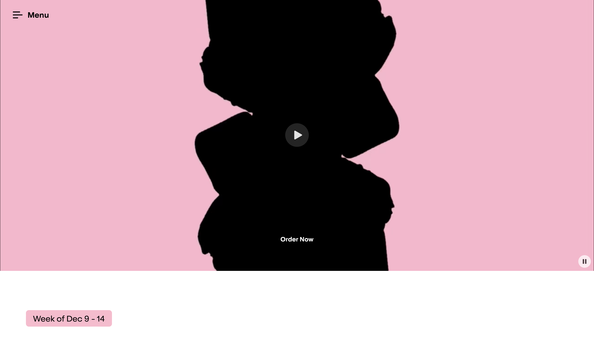

#### Screenshot(s) van de tweede pagina (small screen):

hier de naam van de pagina  
 

## Toegankelijkheidstest 1/2 (week 1)

  
uitwerken na test in 2e werkgroep

### Bevindingen

Aantekeningen pagina 1

wat is goed

Duidelijke typografie en hiërarchie
Grote titels (“National Flavors”) zijn goed leesbaar met voldoende witruimte.
Gebruik van vetgedrukte tekst helpt visueel onderscheid maken.
Kleuren en contrast
De roze en zwarte kleurencombinatie heeft over het algemeen voldoende contrast.
De lichte achtergrond achter tekst (zoals “Dubai Chocolate Cheesecake”) zorgt voor leesbaarheid.
Afbeeldingen met ondersteunende tekst
Elke cookie heeft begeleidende tekst (titel + beschrijving), wat goed is voor screenreaders als de alt-teksten correct zijn toegevoegd.
Knoppen en navigatie
Consistente knoppen zoals “Order Now” en “Learn More”.
De menubalk bovenaan blijft herkenbaar en eenvoudig.
Responsieve layout
De site lijkt zich aan te passen aan verschillende schermgroottes, wat essentieel is voor toegankelijkheid op mobiel.

Wat beter kan
Kleurcontrast bij bepaalde secties
Roze tekst op een witte of lichte achtergrond (zoals “Week of Nov 11–16”) heeft mogelijk te weinig contrast.
Dit kan verbeterd worden volgens de WCAG AA-contrastnorm (minimaal 4.5:1).
Tekst in afbeeldingen
Sommige knoppen of titels lijken in de afbeelding zelf te zitten (zoals de bovenste banner met “Order Now” op de cookie).Dat kan niet gelezen worden door screenreaders → beter als HTML-tekst erboven.
Navigatie met toetsenbord
Knoppen moeten duidelijk focus-states hebben (zichtbare outline als je met Tab navigeert). Dat is vaak onzichtbaar in moderne designs.
Motion / animatie
Als er parallax, hover-animaties of scrollbewegingen zijn, is het belangrijk dat gebruikers via prefers-reduced-motion deze kunnen uitschakelen.
ARIA-labels en semantische HTML
Belangrijk dat secties zoals “National Flavors” en “Secret Menu” duidelijke <section> of <h2>-structuren hebben.
Knoppen als “Order Now” moeten beschrijvend zijn: bijvoorbeeld aria-label="Order Dubai Chocolate Cheesecake" in plaats van alleen “Order Now”.

Aantekeningen pagina 2

wat is goed

Duidelijke uitleg en call-to-actions (“Request Catering”, “See Menu”).
Grote knoppen en eenvoudige flow naar bestellen.

Wat beter kan
Kan beter
Formulieren: controleer of velden labels hebben (<label> gekoppeld aan <input>).
Visuele hiërarchie: sommige teksten op lichte achtergronden hebben laag contrast.
Afbeeldingen: check of alle cookies/taarten alt-teksten hebben met beschrijving.
Toetsenbordnavigatie: dropdowns en invulvelden moeten bedienbaar zijn zonder muis.
Feedback bij fouten: bij verkeerd ingevulde velden moet tekstueel feedback komen (niet alleen kleurverandering).

verbeteringen
duidelijke h1 toe aan het begin van de pagina.
Controleer de headinghiërarchie (h2 voor secties, h3 voor individuele cookies).
Geef alle “Order Now”- en “Learn More”-knoppen unieke, beschrijvende labels.
Overweeg een skip-to-main-content-link voor toetsenbordgebruikers.

Headingsstructuur- Gedeeltelijk goed. De hoofdsecties zijn duidelijk, maar de hero-banner mist een heading en subkoppen moeten semantisch juist zijn.

Links beschrijvend- Niet goed. Veel link teksten. zijn te algemeen en niet informatief zonder context.

## Breakdownschets (week 1)

  
uitwerken na afloop 3e werkgroep

### de hele pagina:

  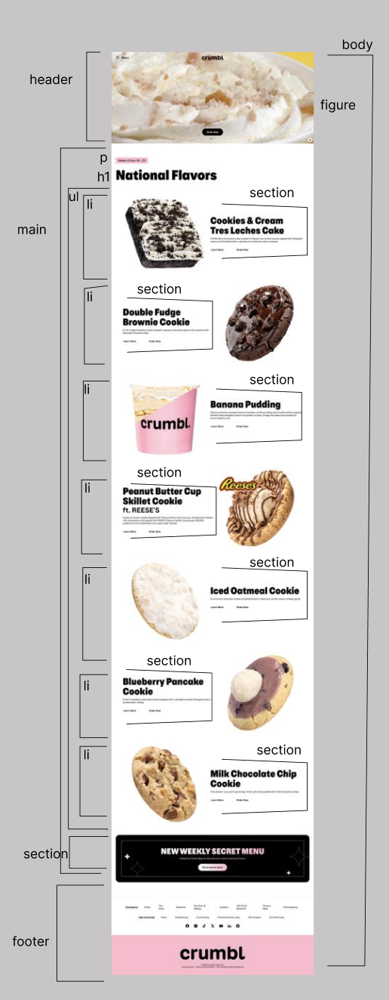

### dynamisch deel (hamburger menu):

  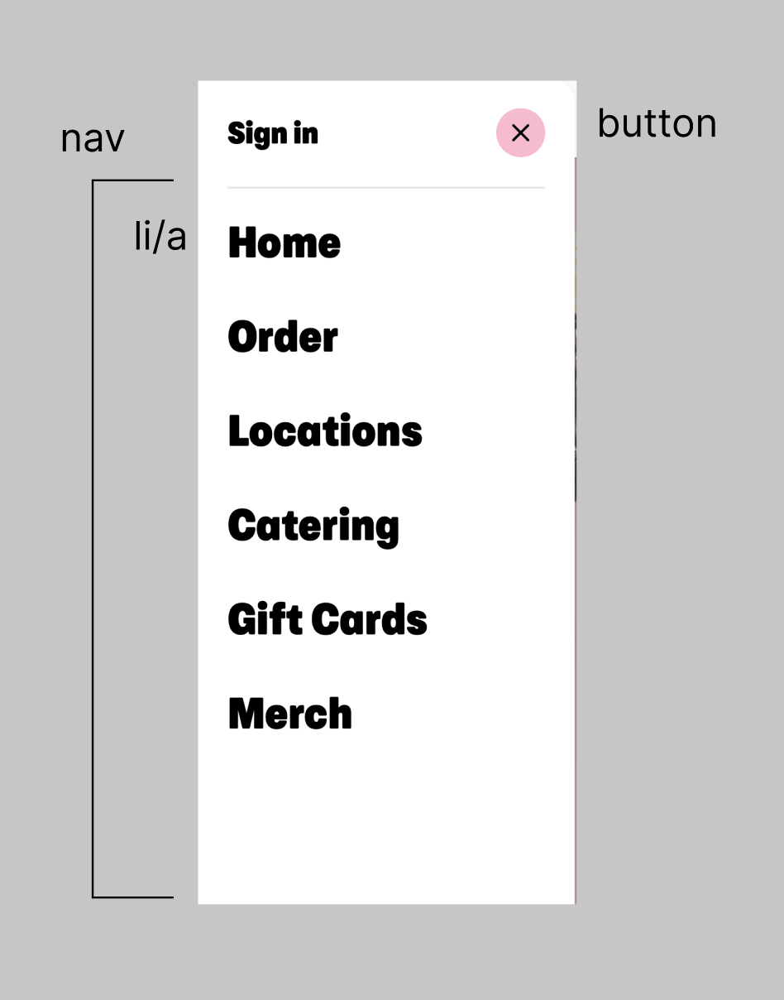

### wellicht nog een dynamisch deel (bijv filter):

  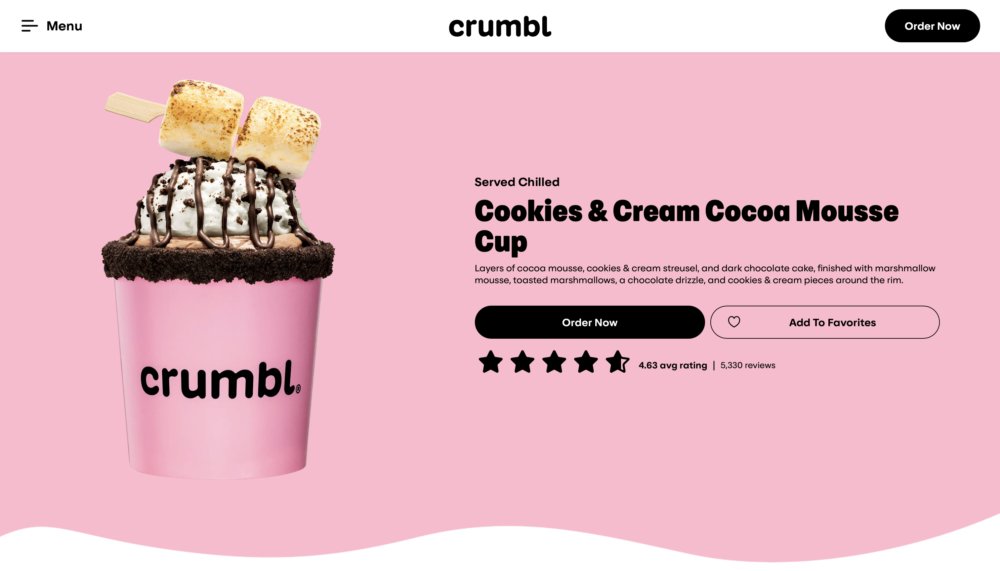

## Voortgang 1 (week 2)

  
uitwerken voor 1e voortgang

### Stand van zaken

html ging me best goed af ik heb alles kunnen maken optijd zonder veel vast te lopen
ik heb wel geleerd dat je ul en li voor heel veel verschillende dingen kan gebruiken
voor nu loopt alles nog soepel ik denk als we css en java moeten schrijven ik meer ga vastlopen en problemen ga hebben

### Agenda voor meeting

samen met je groepje opstellen

Student 1 (Victoria)
Je hoeft geen P te maken om tekst neer te zetten bij een link
Img hoef je niet in een figure te wrappen
Als je in je header veel linkjes heb is het gebruikelijk om een nav te maken.

Student 2 (juliette)
Aria- label bij een link als je het voor de screen reader maken
Bij elke section moet een heading (bij 1 zit een p)
Html in het engels dus bovenste regel veranderen
Breakdown klopt

Student 3 (Sana)
Bij de breakdown ook de elementen aanwijzen
Extension om je document netter neer te zetten (format document)
Tekst over video kan pas bij css

Student 4 (chayenne)
Bij section beginnen met h3 om de tekst kleiner te maken dan h1 en h2 kan niet. Het kan alleen als er boven een h2 is. Dus h2 doen en op een andere manier de styling aanpassen.
Details elementen toepassen
Footer hoeft geen heading te hebben.
Link met een # zorgt ervoor dat die weer naar het begin van de pagina springt. (Gebruiken voor links die je niet gaat gebruiken)

Student 5 (Ana)
Als je iets ergens kan invullen is dat input
De list zelf is de ul en daar zitten li’s in

### Verslag van meeting

hier na afloop snel de uitkomsten van de meeting vastleggen

- html gaat soepel bij iedereen
- img hoef je niet in een figure te stoppen

## Voortgang 2 (week 3)

  
uitwerken voor 2e voortgang

### Stand van zaken

ik heb nu allebei mijn html af ik vond de tweede pagina makkelijk om te maken omdat er minder informatie op stond
ik vond het wel lastig om soms te bepalen wat ik als een button moest zetten of wat ik als link moest zetten.
ik had ook eerst hee; veel sections en die ik later heb veranderd naar ul met li's erin.
tijdens dit gesprek had ik al veel van me css af kwa kleur en hovers. ik had het lastig om te beslissen hoe ik html elementen moest taggen in mijn css en wanneer ik nou een grid of een flexbox moest gebruiken. deze vragen had ik gelaten voor dit gesprek, voor de rest merkte ik wel dat ik iets meer moeite had met css dan java en html. ik gebruik vaak dezelfde tags die soms onnodig zijn en ik tagg html elementen soms niet specifiek genoeg in me css.

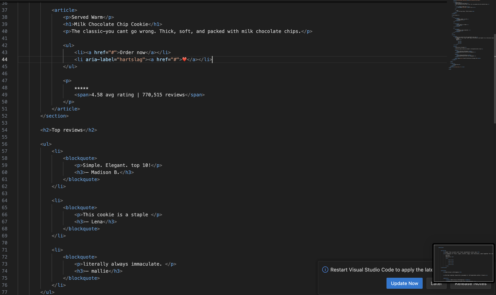

### Agenda voor meeting

samen met je groepje opstellen

| student 1      | student 2          | student 3    | student 4        |
| -------------- | ------------------ | ------------ | ---------------- |
| dit bespreken  | en dit             | en ik dit    | en dan ik dat    |
| en dat ook nog | dit als er tijd is | nog een punt | dit wil ik zeker |
| ...            | ...                | ...          | ...              |

### Verslag van meeting

hier na afloop snel de uitkomsten van de meeting vastleggen

- er zijn andere opties inplaats van sections en articles
- punt 2
-

## Toegankelijkheidstest 2/2 (week 4)

  
uitwerken na test in 9e werkgroep

### Bevindingen

Lijst met je bevindingen die in de test naar voren kwamen (geef ook aan wat er verbeterd is):

## Voortgang 3 (week 4)

  
uitwerken voor 3e voortgang

### Stand van zaken

tijdens dit gesprek had ik eigenlijk alles bijna al af ik had alleen nog moeite met

- sommige elementen aanspreken in css
- de groote van de plaatjes bij pagina 2 laaste section
- ervoor zorgen dat mijn font ook buttons aanspreekt
  mijn groepje was er niet tijdens dit gesprek door de missende docenten

### Agenda voor meeting

student 1 (victoria)
ik moest mijn code goed bekekijken en alle dubbele en onnodigen css elementen weghalen
mijn code was een klein zooitje dus was lastig om dingen te verbeteren

### Verslag van meeting

hier na afloop snel de uitkomsten van de meeting vastleggen

- code netjes maken
- fotos overnieuw erin zetten
- font opnieuw in de button taggen

## Eindgesprek (week 5)

  
uitwerken voor eindgesprek

### Je uitkomst - karakteristiek screenshots:

pagina 1 eerste screenshot
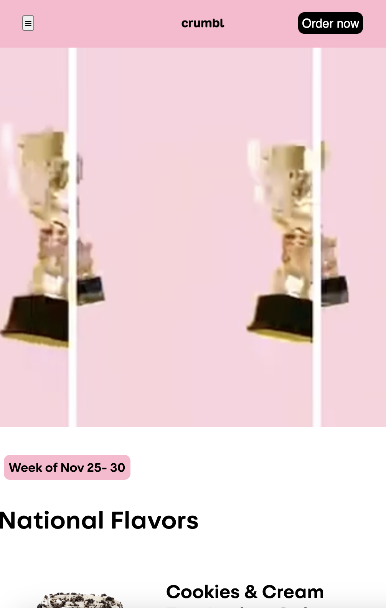

- op deze pagina zie je het voorblad van mijn website dit is de header met daarboven de navigatie met logo en orderbutton

pagina 1 tweede screenshot hamburgermenu
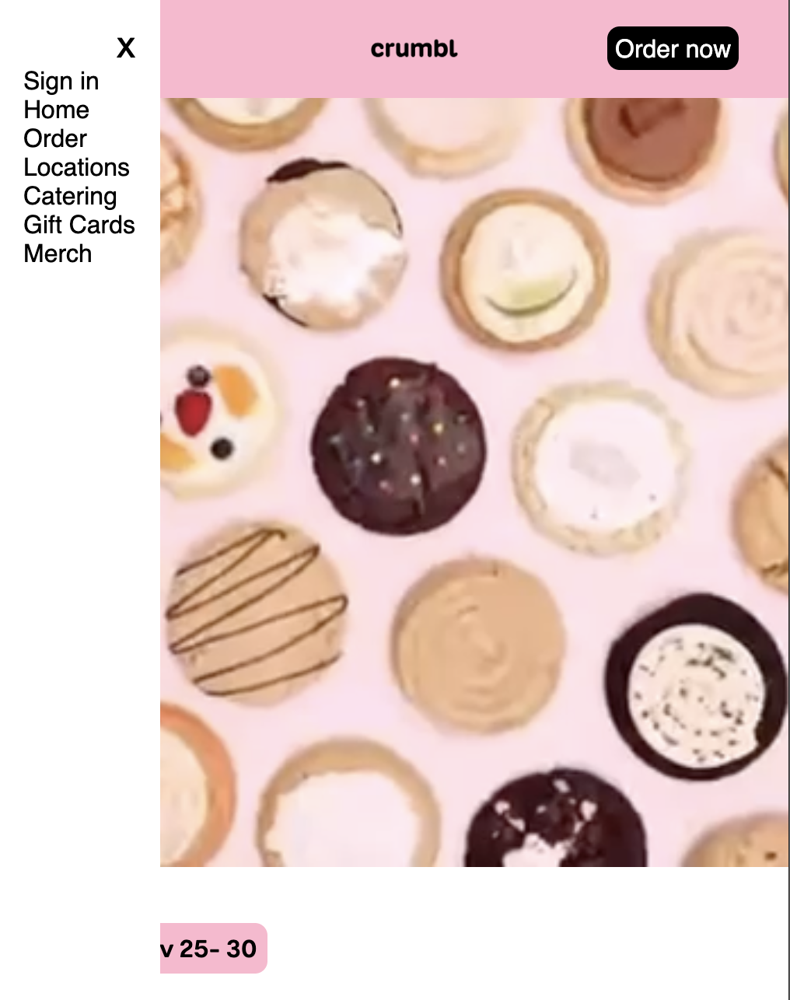

- op dit screenshot zie je hoe mijn hamburger menu is uitgeklapt

pagina 1 derde screenshot main
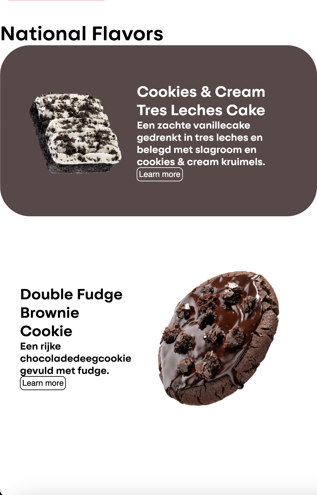

- Op dit screenshot zie je de main van mijn pagina hierin staan alle verschillende koekjes

pagina 1 vierde screenshot footer
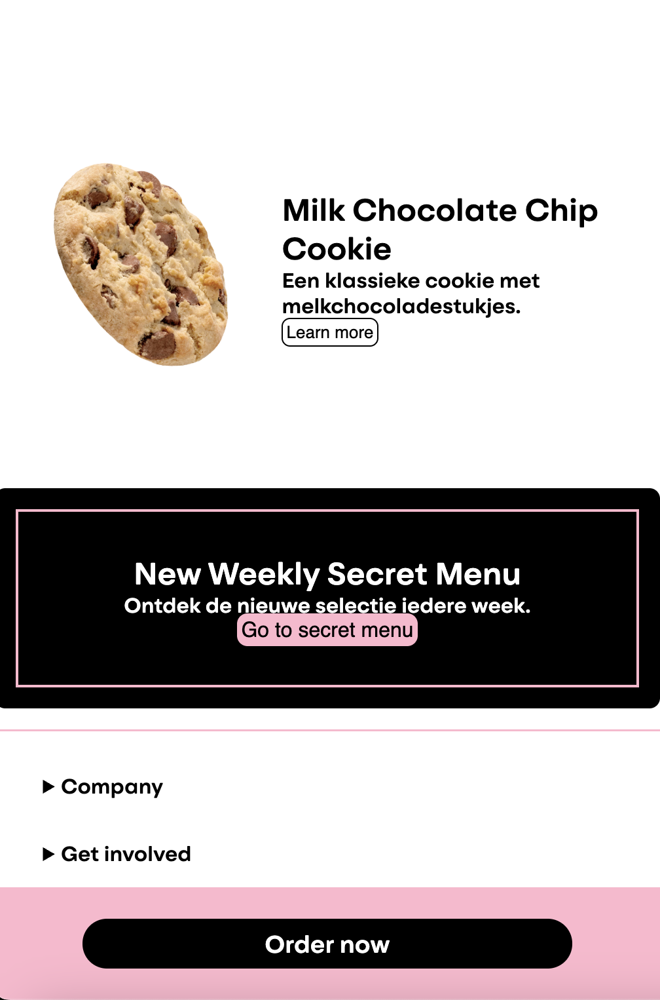

- Op dit screenshot zie je mijn laatste stukje van de main met het secret menu en mijn footer

pagina 2 eerste screenshot main
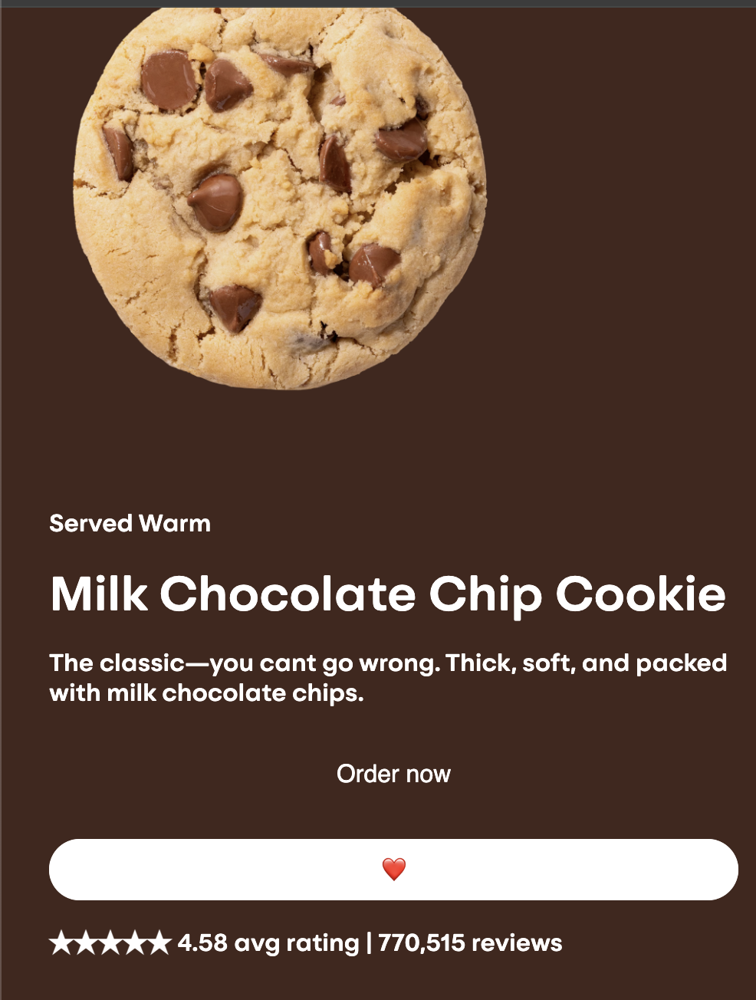

- Op dit screenshot zie je mijn eerste section met de main dit is met twee buttons een voor order now en een is met een hartje als je daar overheen hovert komt een kloppende animatie

pagina 2 tweede screenshot main
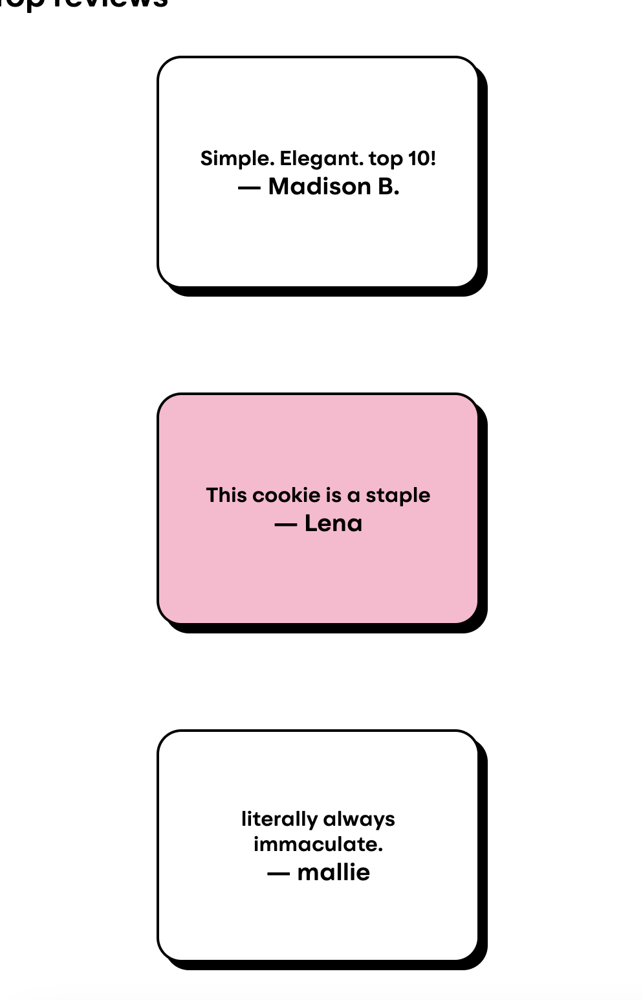

- Op dit screenshot zie je tweede section in de main dit zijn de revieuws van het koekje

pagina 2 derde screenshot main/footer
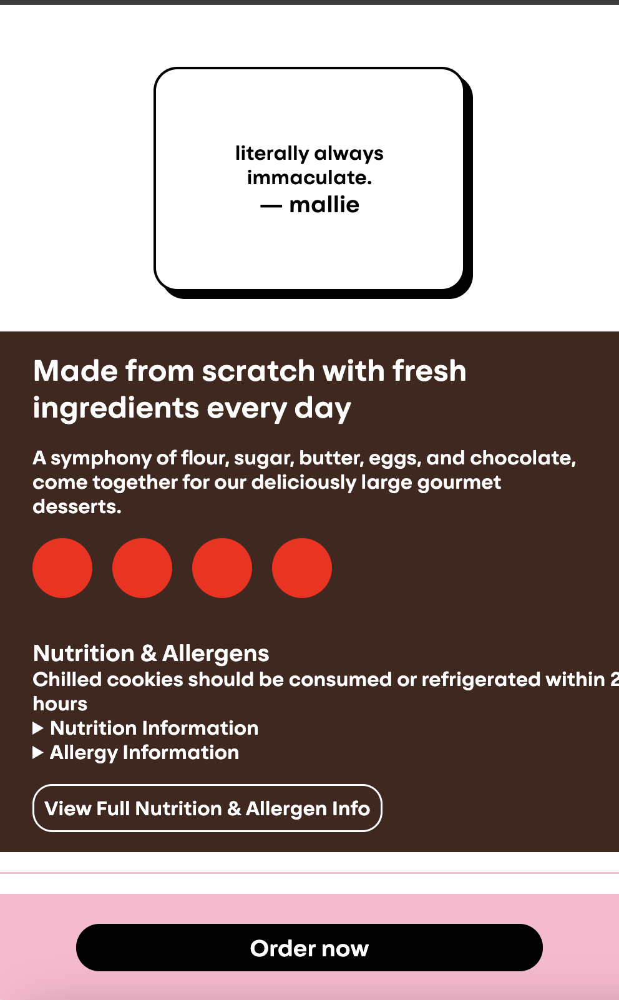

- Op dit screenshot zie je mijn laatse section in de main en footer de footer heb ik hetzelfde gehouden

### Dit ging goed/Heb ik geleerd:

Korte omschrijving met plaatjes

op me eerste pagina ging het gelijk goed met html elementen aanspreken in css en hovers toevoegen

op me website is er een hamburger menu die ik heb gemaakt met javascript dit ging heel soepel en was minder lastig dan ik dacht

### Dit was lastig/Is niet gelukt:

Korte omschrijving met plaatjes
op me eerste pagina had ik met de verschillende li's moete om flexbox of grid aan te pasen ik had hierbij hulp gevraagd aan david en uiteindelijk bleek het dat ik mijn img buiten de flex moest doen en toen lukte het

op me tweede pagina laaste section had ik heel veel moeite met de plaatjes naast elkaar krijgen en een goede grote te bepalen uit eindelijk bleek het dat er de screens van de plaatjes te groot waren en dat de echte website 1 plaatje had terwijl ik alles apart had en daarna in een flexbox had gedaan uiteindelijk heb ik ervoor gekozen om de plaatjes eruit te halen en het te vervangen met rondjes

## Bronnenlijst

  
continu bijhouden terwijl je werkt

Nb. Wees specifiek ('css-tricks' als bron is bijv. niet specifiek genoeg).
Nb. ChatGpT en andere AI horen er ook bij.
Nb. Vermeld de bronnen ook in je code.

1. De oefeningen van code pen die we in de les hebben gekregen
2. Hulp van studentassistenten David, Maya
3. Eigen notities uit de les
4. alle fotos en tekst in mijn site (https://crumblcookies.com)

